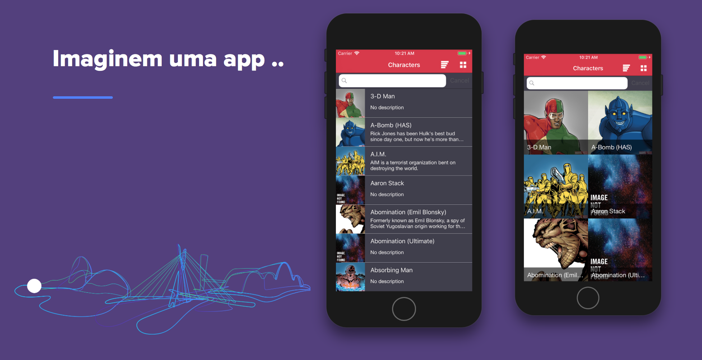

# Marvel App

-------

    <a href="#appearance">Appearance</a> &bull;
    <a href="#motivation">Motivation</a>

-------

## Appearance

<h3 align="center">
  
</h3>

## Motivation

App base para a apresentação no coders on beer realizado na Concrete dia 20/02/2018.

## License
This project is licensed under the terms of the MIT license. See the LICENSE file.
